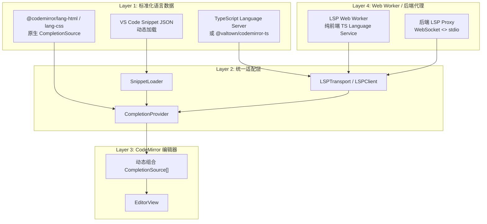

# 代码补全架构重构 — 详细实施方案

> 基于 [`plans/completion-refactor-plan.md`](plans/completion-refactor-plan.md) 的扩展与细化，增加可落地的文件级改造清单、接口设计与风险预警。

---

## 0. 现状快照

| 维度 | 当前状态 | 问题 |
|------|---------|------|
| **HTML 补全** | [`autocompleteService.ts`](../FeiShu-Codepen-Frontend/src/services/autocompleteService.ts) 中手写 `htmlTags[]` + `commonAttributes[]` | 维护滞后、覆盖不全 |
| **CSS 补全** | 手写 `cssProperties[]` + `propertyValues{}` | 新属性无法自动同步 |
| **JS/TS/框架补全** | 手写 `jsSnippets[]` / `reactSnippets[]` / `vueSnippets[]` / `tsSnippets[]` | 扩展成本极高 |
| **AST 语义补全** | [`astCompletionService.ts`](../FeiShu-Codepen-Frontend/src/services/astCompletionService.ts) 用正则提取变量 | 无真正的类型推断 |
| **编辑器耦合** | [`Editor.tsx`](../FeiShu-Codepen-Frontend/src/components/Editor.tsx) 内通过 `switch-case` 硬编码补全源 | 新增语言需改核心组件 |
| **后端能力** | Express + MongoDB，仅 REST API | 无 WebSocket / 无 LSP 代理 |

---

## 1. 目标架构（四层模型）



---

## 2. Phase 1：基建与低垂果实

### 2.1 目标
- 建立统一的 `CompletionProvider`，彻底解耦 `Editor.tsx`。
- HTML/CSS 放弃手写字典，全面使用 CodeMirror 官方语言包的原生补全。
- 保留项目特有的自定义 snippet（如 `html5` 文档模板）。

### 2.2 新建文件

```
FeiShu-Codepen-Frontend/src/services/completion/
├── index.ts                 # 统一导出
├── completionProvider.ts    # 核心适配器
├── languageRegistry.ts      # 语言元数据注册表
└── snippetLoader.ts         # Snippet 加载器（Phase 2 填充实现）
```

#### `languageRegistry.ts` 设计
```typescript
export type EditorLanguage =
  | 'html'
  | 'css' | 'scss' | 'less'
  | 'js' | 'react' | 'vue' | 'ts';

export interface LanguageConfig {
  id: EditorLanguage;
  cmLanguage: () => Extension;
  baseCompletionSources: CompletionSource[];
  snippetLanguageId?: string; // 映射到 json 文件名，如 'react'
  enableLSP?: boolean;
}

export const languageRegistry = new Map<EditorLanguage, LanguageConfig>(...);
```

#### `completionProvider.ts` 设计
```typescript
export class CompletionProvider {
  getSources(languageId: EditorLanguage): CompletionSource[] {
    const config = languageRegistry.get(languageId);
    if (!config) return [];
    const snippets = snippetLoader.loadSync(config.snippetLanguageId || languageId);
    const lsp = lspAdapter.getSource(languageId); // Phase 3 接入
    return [
      ...(config.baseCompletionSources || []),
      ...(snippets || []),
      ...(lsp ? [lsp] : [])
    ].filter(Boolean);
  }
}
```

### 2.3 改造文件

| 文件 | 操作 | 说明 |
|------|------|------|
| [`autocompleteService.ts`](../FeiShu-Codepen-Frontend/src/services/autocompleteService.ts) | **删除** | 移除 `htmlTags[]`、`cssProperties[]`、`propertyValues{}`、`htmlTagCompletionSource`、`cssSnippetCompletionSource`、`cssSnippetCompletionSource` 中硬编码的 HTML/CSS 字典。保留并导出 `htmlCustomSnippetSource`（仅 html5 模板等）和 `bracketMatchingExtension` / `closeBracketsExtension`。 |
| [`Editor.tsx`](../FeiShu-Codepen-Frontend/src/components/Editor.tsx) | **修改** | 删除 switch-case 中硬编码的 `htmlAutocomplete` / `cssAutocomplete` / `jsAutocompleteExt` 构造逻辑。改为统一调用 `completionProvider.getSources(languageId)`。 |

### 2.4 验证清单
- [ ] HTML 编辑器输入 `<div` 仍能出现标签补全（来自 `@codemirror/lang-html`）。
- [ ] CSS 编辑器输入 `display:` 仍能出现属性值补全（来自 `@codemirror/lang-css`）。
- [ ] `html5` 模板 snippet 仍可触发。

---

## 3. Phase 2：Snippet 配置化

### 3.1 目标
- 将 `jsSnippets[]`、`reactSnippets[]` 等硬编码片段提取为独立的 JSON 文件。
- 实现 `SnippetLoader`，支持 `import('../snippets/${lang}.json')` 动态加载。
- `Editor.tsx` 彻底不再引用具体 snippet 源。

### 3.2 新建文件

```
FeiShu-Codepen-Frontend/src/snippets/
├── html.json
├── css.json
├── js.json
├── react.json
├── vue.json
└── ts.json
```

**JSON 格式示例（`react.json`）**：
```json
{
  "useState": {
    "prefix": "useState",
    "body": "const [$1, set$1] = useState($2);",
    "description": "React useState hook"
  },
  "reactFunctionComponent": {
    "prefix": "rfc",
    "body": "function ${1:ComponentName}(${2:props}) {\n\treturn (\n\t\t${3}\n\t);\n}",
    "description": "React function component"
  }
}
```

### 3.3 改造文件

| 文件 | 操作 | 说明 |
|------|------|------|
| [`autocompleteService.ts`](../FeiShu-Codepen-Frontend/src/services/autocompleteService.ts) | **删除** | 彻底删除 `jsSnippetCompletionSource`、`reactSnippetCompletionSource`、`vueSnippetCompletionSource`、`tsSnippetCompletionSource`。 |
| `services/completion/snippetLoader.ts` | **新建** | 实现 `loadSnippets(langId)` 和 `loadSync(langId)`，将 JSON 条目转换为 `snippetCompletion()` 结果。 |
| `services/completion/completionProvider.ts` | **修改** | 集成 `snippetLoader`。 |
| [`Editor.tsx`](../FeiShu-Codepen-Frontend/src/components/Editor.tsx) | **修改** | 删除对 `jsSnippetCompletionSource` 等所有 snippet 的直接 import。 |

### 3.4 可选增强
- 构建时脚本 `scripts/convert-vscode-snippets.ts`：将 VS Code snippet 仓库的 JSON 转换为本项目格式。
- 新增 Angular/Svelte 时，只需新增 `angular.json` / `svelte.json`，无需改代码。

---

## 4. Phase 3：语义分析与 LSP

### ⚠️ 关键技术修正（需重点讨论）

原计划中提到的 **"@codemirror/lsp-client" 目前并不存在**（CodeMirror 官方未发布该包）。
因此 Phase 3 需要**自建 LSP Transport + JSON-RPC 客户端适配层**。

### 4.1 方案分叉（需要用户拍板）

| 方案 | 技术路径 | 优点 | 缺点 | 推荐度 |
|------|---------|------|------|--------|
| **A. 纯前端 TS** | 使用 [`@valtown/codemirror-ts`](https://github.com/val-town/codemirror-ts) 或直接在 Web Worker 中运行 `typescript.createLanguageService` | 无需后端改造；JS/TS 补全效果接近 VS Code；部署简单 | 仅支持 JS/TS；Worker 内存占用较大 | ⭐⭐⭐⭐⭐ |
| **B. 前后端 LSP** | 后端 spawn `typescript-language-server`，前端通过 WebSocket 自建 LSP Client 连接 | 通用性强，未来可扩展 Python/C++ 等语言 | 工程量大；需要维护进程生命周期；Windows 下 spawn 兼容性坑多 | ⭐⭐⭐ |
| **C. 换 Monaco** | 将 CodeMirror 替换为 Monaco Editor，配合 `monaco-languageclient` | LSP 生态最成熟 | 需要重写所有编辑器逻辑和样式；工程浩大 | ⭐⭐ |

> **建议**：若当前核心痛点仅是 **JS/TS/React/Vue 的类型补全**，优先选 **方案 A**。若明确未来要支持 Python/C++/Java 等多语言 LSP，再选 **方案 B**。

### 4.2 若选方案 B（前后端 LSP）的详细设计

#### 后端改造

**新增依赖**：
```bash
npm install ws
npm install --save-dev typescript-language-server typescript
```

**新建文件**：
```
FeiShu-Codepen-Backend/src/
├── services/
│   └── lspProxy.js          # LSP 进程管理与消息转发
├── websocket/
│   └── lspServer.js         # WebSocket 服务器挂载
└── routes/
    └── lsp.js               # （可选）LSP 健康检查 REST 接口
```

**`lspProxy.js` 核心逻辑**：
```javascript
const { spawn } = require('child_process');

class LspProxy {
  constructor(ws, command, args) {
    this.ws = ws;
    this.process = spawn(command, args, { shell: process.platform === 'win32' });
    
    this.process.stdout.on('data', (data) => {
      // 解析 LSP Content-Length 头，完整消息后转发给前端
      this.bufferAndForward(data);
    });
    
    this.ws.on('message', (msg) => {
      // 将前端 JSON-RPC 消息写入 LSP 进程 stdin
      const payload = `Content-Length: ${Buffer.byteLength(msg)}\r\n\r\n${msg}`;
      this.process.stdin.write(payload);
    });
    
    this.ws.on('close', () => this.process.kill());
  }
}
```

**`index.js` 修改**：在 Express HTTP Server 上挂载 `WebSocket.Server`，并监听 `/lsp` 路径。

#### 前端改造

**新建文件**：
```
FeiShu-Codepen-Frontend/src/services/lsp/
├── lspTransport.ts          # WebSocket + JSON-RPC 消息收发
├── lspClient.ts             # request/response id 映射、notification 订阅
├── messageBuffer.ts         # 处理 Content-Length 分帧
└── tsLspCompletionSource.ts # 将 LSP completion 转为 CodeMirror CompletionSource
```

**`tsLspCompletionSource.ts` 核心逻辑**：
```typescript
export function createLspCompletionSource(client: LSPClient): CompletionSource {
  return async (context) => {
    const word = context.matchBefore(/\w*/);
    const doc = context.state.doc;
    const pos = context.pos;
    
    // 发送 textDocument/completion
    const result = await client.request('textDocument/completion', {
      textDocument: { uri: 'file:///src/index.ts' },
      position: { line: doc.lineAt(pos).number - 1, character: pos - doc.lineAt(pos).from }
    });
    
    if (!result || !Array.isArray(result.items)) return null;
    
    return {
      from: word ? word.from : pos,
      options: result.items.map((item: any) => ({
        label: item.label,
        type: mapLspKindToCm(item.kind),
        apply: item.insertText || item.label,
        detail: item.detail,
        info: item.documentation?.value
      }))
    };
  };
}
```

**`Editor.tsx` 修改**：
- 在组件 mount 时初始化 `LSPClient`（或 Web Worker）。
- 将 `createLspCompletionSource(client)` 注册到 `CompletionProvider`。

### 4.3 若选方案 A（纯前端 TS）的详细设计

**新增依赖**：
```bash
npm install @valtown/codemirror-ts
# 或直接用 typescript
```

**新建文件**：
```
FeiShu-Codepen-Frontend/src/workers/
├── tsWorker.ts              # 在 Worker 中创建 TS Language Service
└── tsWorkerAdapter.ts       # Worker 与主线程的通信封装
```

**`tsWorker.ts` 核心逻辑**：
```typescript
import * as ts from 'typescript';

// 创建虚拟文件系统
const files = new Map<string, string>();
const compilerHost: ts.CompilerHost = {
  getSourceFile: (name) => files.has(name) ? ts.createSourceFile(name, files.get(name)!, ts.ScriptTarget.Latest) : undefined,
  writeFile: () => {},
  getDefaultLibFileName: () => 'lib.d.ts',
  useCaseSensitiveFileNames: () => false,
  getCanonicalFileName: (fileName) => fileName,
  getCurrentDirectory: () => '/',
  getNewLine: () => '\n',
  fileExists: (name) => files.has(name),
  readFile: (name) => files.get(name),
  directoryExists: () => true,
  getDirectories: () => []
};

const service = ts.createLanguageService({
  getCompilationSettings: () => ({ module: ts.ModuleKind.ESNext, target: ts.ScriptTarget.ES2020, jsx: ts.JsxEmit.React }),
  getScriptFileNames: () => Array.from(files.keys()),
  getScriptVersion: () => '0',
  getScriptSnapshot: (name) => files.has(name) ? ts.ScriptSnapshot.fromString(files.get(name)!) : undefined,
  getCurrentDirectory: () => '/',
  getDefaultLibFileName: () => 'lib.d.ts',
  fileExists: compilerHost.fileExists,
  readFile: compilerHost.readFile,
  directoryExists: compilerHost.directoryExists,
  getDirectories: compilerHost.getDirectories
});

self.onmessage = (event) => {
  const { type, code, fileName, position } = event.data;
  if (type === 'update') {
    files.set(fileName, code);
  } else if (type === 'complete') {
    const completions = service.getCompletionsAtPosition(fileName, position, undefined);
    self.postMessage({ type: 'complete', completions });
  }
};
```

---

## 5. Phase 4：类型补全与调优

### 5.1 自动类型获取（ATA）
- **目标**：在浏览器中动态拉取 `@types/react`、`vue` 等 `.d.ts` 文件。
- **实现**：
  - 使用 [unpkg](https://unpkg.com) 或 [jsdelivr](https://www.jsdelivr.com) CDN 拉取类型包。
  - 在 Web Worker / LSP 初始化时，预加载核心类型定义。
  - 将下载的 `.d.ts` 内容缓存到 `IndexedDB`，减少重复请求。

### 5.2 断网降级
- **检测**：监听 WebSocket `onclose` 或 Worker 错误事件。
- **降级策略**：
  1. 若 IndexedDB 中已有缓存类型，继续使用缓存类型进行补全。
  2. 若完全无缓存，回退到 `CompletionProvider` 中的基础 snippet + 关键字补全。

### 5.3 性能优化
- **Debounce**：LSP 请求或 Worker 消息发送前增加 150-300ms debounce。
- **请求去重**：若上一次补全请求尚未返回，且光标位置变化在 1 个字符内，取消旧请求。
- **大文件保护**：当文件超过 5000 行时，关闭实时语义检查，仅保留手动触发的补全（Ctrl+Space）。

---

## 6. 文件改造总览

### 前端

| 路径 | Phase | 操作 |
|------|-------|------|
| `src/services/completion/completionProvider.ts` | 1 | 新建 |
| `src/services/completion/languageRegistry.ts` | 1 | 新建 |
| `src/services/completion/snippetLoader.ts` | 2 | 新建 |
| `src/services/completion/index.ts` | 1 | 新建 |
| `src/services/autocompleteService.ts` | 1/2 | 大幅精简（删除硬编码字典和 snippet） |
| `src/services/astCompletionService.ts` | 3 | 可选：标记为废弃或作为降级保留 |
| `src/components/Editor.tsx` | 1 | 修改（解耦 switch-case） |
| `src/snippets/*.json` | 2 | 新建 |
| `src/services/lsp/*` | 3 | 新建（若选方案 B） |
| `src/workers/tsWorker.ts` | 3 | 新建（若选方案 A） |

### 后端

| 路径 | Phase | 操作 |
|------|-------|------|
| `package.json` | 3 | 增加 `ws`、`typescript-language-server` 依赖 |
| `src/websocket/lspServer.js` | 3 | 新建 |
| `src/services/lspProxy.js` | 3 | 新建 |
| `src/index.js` | 3 | 修改（挂载 WebSocket Server） |

---

## 7. 风险与缓解措施

| 风险 | 影响 | 缓解措施 |
|------|------|----------|
| **@codemirror/lsp-client 不存在** | 高 | 自建 Transport + JSON-RPC 适配器；或改用纯前端 `@valtown/codemirror-ts`。 |
| **Windows 下 spawn LSP 进程失败** | 中 | 使用 `shell: true` 和 `windowsHide: true`；在 CI 中覆盖 Windows 测试。 |
| **TS Language Service 包体积过大** | 中 | 走 Web Worker + CDN 按需加载；核心类型预缓存到 IndexedDB。 |
| **WebSocket 连接不稳定** | 中 | 实现自动重连 + 断网降级到本地 snippet。 |
| **Monaco 迁移诱惑** | 低 | 明确本次重构不换编辑器，降低范围蔓延。 |

---

## 8. 排期与里程碑

| Phase | 核心任务 | 预计工期 | 关键交付物 |
|-------|---------|---------|-----------|
| **Phase 1** | 统一适配层；HTML/CSS 原生补全替换；清理硬编码字典 | 1 周 | `CompletionProvider` 可用；HTML/CSS 补全无需手动维护 |
| **Phase 2** | Snippet JSON 化；动态加载器；迁移现有模板 | 0.5 周 | 所有 snippet 外部化；新增语言只需加 JSON |
| **Phase 3** | 语义补全：选定 LSP 方案并实现 JS/TS 智能提示 | 1.5-2 周 | JS/TS 具备上下文感知补全；废弃旧版正则 AST 补全 |
| **Phase 4** | ATA 类型缓存；断网降级；性能调优 | 1 周 | React/Vue API 参数可提示；大文件不卡顿 |

---

## 9. 需要你拍板的 3 个关键决策

1. **LSP 方案选择**
   - **A（推荐）**：纯前端 `@valtown/codemirror-ts` / Web Worker，快速见效，无需后端改动。
   - **B**：前后端分离 LSP Proxy，通用但工作量大。
   - **C**：迁移到 Monaco Editor（不推荐，除非你愿意重写整个编辑器）。

2. **是否保留旧 AST 正则补全作为降级**
   - **保留**：在 LSP 未初始化或失败时，回退到现有 `astCompletionService.ts` 的基础变量提示。
   - **删除**：Phase 3 完成后直接删除 `astCompletionService.ts`，减少历史包袱。

3. **ATA 类型来源**
   - **unpkg/jsdelivr CDN**：简单，但依赖外网。
   - **本地预置**：把 `@types/react` 等核心类型打包进项目，离线可用但增加体积。

---

## 10. 下一步行动

如果你认可上述方案，我们可以按以下顺序进入开发：

1. 你先确认 **LSP 方案（A/B/C）** 和 **是否保留旧 AST 补全**。
2. 我先实现 **Phase 1 + Phase 2**（统一适配层 + Snippet 配置化），这是低风险高回报的部分。
3. Phase 1/2 验证通过后，再进入 **Phase 3** 的 LSP/语义补全开发。

有什么想调整或需要我进一步细化的吗？
